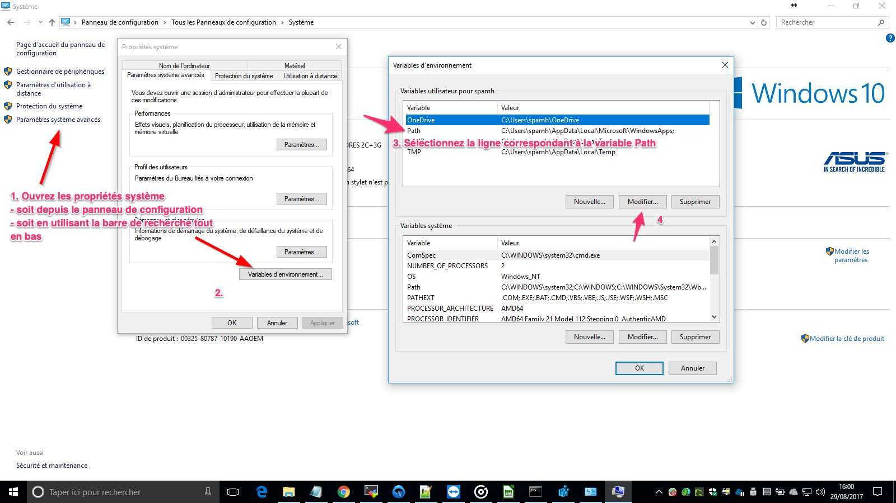
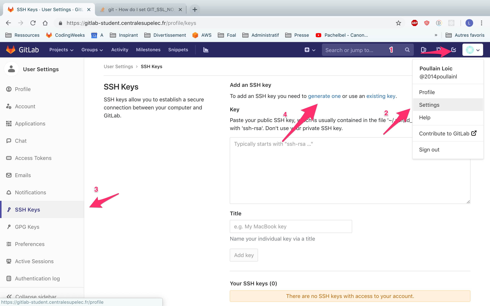
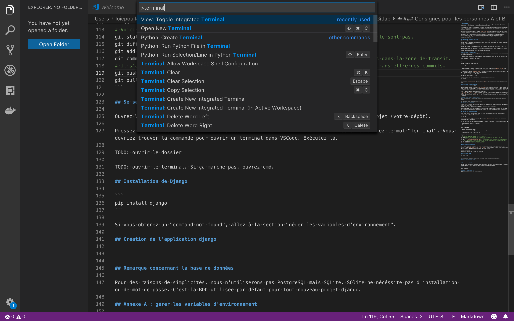
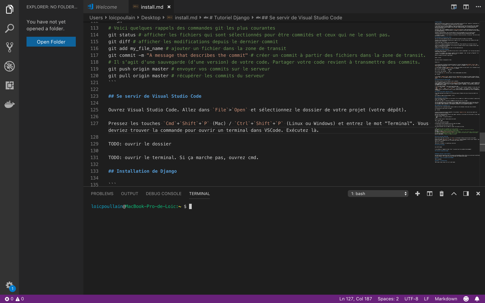

# Tutoriel Django

Compte-tenu des difficultés rencontrées la veille, cette nouvelle version du TP vise à simplifier l'installation, la configuration et le développement de votre application pour cette semaine.

Il vous détaillera les différentes commandes à utiliser en fonction des spécificités de vos OS (Mac, Linux, Windows) et des erreurs recontrées lors des installations. Dans cette nouvelle version, seul le terminal sera utilisé pour gérer vos versions git, installer django et créer et lancer l'application Django. C'est une pratique que vous retrouverez également en entreprise.

Concernant l'IDE, je vous recommande d'installer [Visual Studio Code](https://code.visualstudio.com/) qui est bien plus simple que PyCharm. L'installation devrait être rapide. Si toutefois, vous préferez continuer d'utiliser PyCharm, je ne vous empêcherai pas. 

Concernant la base de données, nous utiliserons SQLite et non plus PostgreSQL car elle ne nécessite aucune installation particulière et qu'elle est déjà utilisée et préconfigurée dans tout nouveau projet Django.

> Ce document est évolutif. Si vous rencontrez un problème et trouvez une solution, n'hésitez pas à venir me voir pour qu'on puisse le compléter.

## Terminologie et présentation des technos

*Git* est une solution opensource pour gérer les différentes versions d'un code et se les partager.

*Gitlab* est une plateforme web collaborative qui s'appuit sur Git. C'est par Gitlab qui vous stockerez votre code à distance et que j'y aurai accès.

*Visual Studio Code* et *PyCharm* sont des éditeurs de code.

*Python* est le langage de programmation utilisé lors de ce cours. Nous travaillons sur la version 3 (pas la 2).

*pip* est un gestionnaire de dépendances. C'est lui qui est en charge d'installer toutes les paquets externes (dont django) utilisés dans votre projet.

*Django* est un framework backend utilisé pour créer des applications web.

## Installation de python globalement

La première étape est de vérifier que python (et pip) sont déjà installés globallement, c'est-à-dire que vous pouvez y accéder depuis votre terminal.

> Si vous êtes sur Windows, votre terminal s'appelera "Invite de commandes", "cmd", "Git bash" ou "Powershell". Par simplicité, j'utiliserai le terme "terminal" par la suite.

Ouvrez un terminal et exécutez le code suivant :

```
python --version
```

Vous devriez obtenir un message de la forme :

```
Python 3.6.2
```

> Si la version qui s'affiche est la version 2 et pas la 3, réitérez l'expérience avec `python3 --version`. Vous devriez trouver le bon numéro de version. Il faudra alors remplacer les commandes `python` et `pip` par `python3` et `pip3` dans tout l'énoncé du TP.

> Si vous obtenez le message `command not found`, c'est que, soit python n'est pas installé, soit l'ordinateur ne sait pas où se situe l'exécutable python. Il va falloir lui indiquer en modifiant ce qu'on appelle le `PATH`. Le `PATH` est une liste de répertoires (=dossiers) où votre ordinateur va regarder s'il trouve l'exécutable python.
>
> Vous devez trouver par vous-même où se situe votre exécutable python. Sous Windows, si vous avez installé python depuis [le site officiel](https://www.python.org/downloads/), le nom du dossier hôte s'appelle probablement `C:\Program Files\Python37` (ici la version est 3.7). Sous Mac, le dossier s'appelle probablement `/Library/Frameworks/Python.framework/Versions/3.6/bin` (Pour trouver le numéro de version, exécutez la commande `ls /Library/Frameworks/Python.framework/Versions`).
> 
> Certains ont téléchargé python via Anaconda (bad luck), il faudra chercher dans votre dossier anaconda où l'exécutable se trouve (quelques pistes : `bin`, `lib`)
>
> Une fois le chemin du répertoire récupéré, vous allez donc modifier le `PATH`.
>
> Sur Windows, procédez comme suit :
> 
> Une nouvelle fenêtre apparaît où vous pouvez alors rentrer une nouvelle ligne avec le nom du répertoire. Cliquez ensuite sur les boutons ok. Vous devrez réouvrir votre terminal pour que les modifications soient prises en compte.
>
> Sous Mac, il faut le faire via la ligne de commande avec ces instructions :
> ```
> cd
> nano .bash_profile
> ```
> Un texte apparaît sur l'écran. Utilisez les flèches pour ajouter cette ligne (de préférence vers le bas):
> ```
> export PATH="le_chemin_du_dossier:${PATH}"
> ```
>
> Pour fermer, tapez `Ctrl`+`X` puis `Y` puis `Enter`. Ensuite rentrez la commande suivante pour prendre en compte les modifications.
>
> ```
> source .bash_profile
> ```
>
> Ouvrez maintenant un nouveau terminal, cela devrait fonctionner.

Vérifiez également que `pip` est bien installé (fourni automatiquement avec python):
```
pip --version
```

Si vous obtenez `command not found`, veuillez suivre les étapes détaillées ci-dessus en trouvant le dossier hôte de `pip.exe` (ou `pip`). Généralement, sous Windows, ce dossier s'intitule `Scripts` et se situe dans le dossier contenant l'exécutable python.

## Installation de votre éditeur de code

Vous pouvez continuer d'utiliser PyCharm si vous le souhaitez.

Je vous recommande cependant d'installer [Visual Studio Code](https://code.visualstudio.com/) (à ne pas confondre avec Visual Studio) qui est l'éditeur qui s'est le plus popularisé ces dernières années. Il est très adapté à python et au développement web et, surtont, il est très facile à prendre en main et à comprendre. J'utiliserai cette éditeur pour les démonstrations au tableau.

Il n'y a que deux commandes à retenir dans Visual Studio Code :
- `Cmd` + `P` (Mac) / `Ctrl` + `P` (Linux et Windows) : utile pour trouver facilement rapidement un fichier dans votre projet
- `Cmd` + `Shift` + `P` (Mac) / `Ctrl` + `Shift` + `P` (Linux ou Windows) : vous permet de trouver n'importe quelle commande. Il suffit juste de taper les mots clés dans la barre de recherche qui apparaît pour trouver la commande que l'on souhaite.

## Création de votre dépôt (repository) Gitlab

Il est temps maintenant de configurer Git et Gitlab pour pouvoir collaborer entre vous et ensuite me remettre vos "copies".

Votre binôme est composé de deux personnes : A et B.

### Consignes pour la personne A

Allez sur Gitlab et créez un dépôt si ce n'est pas déjà fait. Le depôt est la "boîte" qui va contenir le code de votre projet. Voici comment faire :


Vous allez maintenant ajouter votre binôme et votre enseignant comme collaborateur de votre dépôt. Pour cela, allez sur votre depôt GitLab et choisissez le menu Settings | Members dans la fenêtre de gauche. Ajouter votre binôme et votre enseignant comme collaborateur. Votre binôme sera Developer et votre enseignant sera Reporter.

### Consignes pour les personnes A et B

Chacun de votre côté va maintenant devoir copier ce dépôt sur votre ordinateur. Ouvrez pour cela un terminal.

Vérifiez que git est bien installé en tapant :
```
git --version
```

Le numéro de version de git devrait apparaître. Si vous obtenez `Command not found`, merci de vous reporter aux directives présentées en ci-dessous.

Une fois fait, placez-vous dans le dossier (aussi appelé répertoire) où vous voulez créer votre projet (il peut s'agir du bureau, de mes documents, etc)

> Pour se placer à la racine d'un dossier, il faut utiliser la commande `cd` (normalement vue en SIP).
>
> `cd my_dir` <=> aller dans le sous-dossier `my_dir`
>
> `cd ..` <=> aller dans le dossier  parent

Allez sur Gitlab récupérer l'adresse web de votre dépôt.


Et maintenant clonez le dépôt dans votre machine (ne le faites pas dans un dossier où il y a déjà des fichiers...)

> git clone l_adresse_de_votre_depot

Un nouveau dossier devrait apparaître avec votre code inclus dedans.

> Si vous obtenez une erreur de certificat (qui sert à crypter vos échanges entre votre ordinateur et Gitlab), vous avez deux solutions :
>
> Soit vous désactivez SSL avec la commande `git config http.sslVerify false` (à exécuter à la racine de votre projet). Quelqu'un peut-il venir me confirmer que cela fonctionne ?
>
> Soit vous créez une clé ssh.
>
> 
>
> Vous devrez ensuite ajouter votre clé dans le rectangle ci-dessus.

Vous pouvez maintenant faire vos commits et "pusher" vos versions sur Gitlab.

```sh
# Voici quelques rappels des commandes git les plus courantes
git status # afficher les fichiers qui sont sélectionnés pour être commités et ceux qui ne le sont pas.
git diff # afficher les modifications depuis le dernier commit
git add my_file_name # ajouter un fichier dans la zone de transit
git commit -m "A message that describes the commit" # créer un commit à partir des fichiers dans la zone de transit.
# Il s'agit d'une sauvegarde (d'une version) de votre code. Partager votre code revient à transmettre des commits.
git push origin master # envoyer vos commits sur le serveur
git pull origin master # récupérer les commits du serveur
```

## Se servir de Visual Studio Code

Uniquement pour ceux utilisant Visual Studio Code. Les autres, ouvrez un terminal à la racine de votre projet.

Ouvrez Visual Studio Code. Allez dans `File`>`Open` et sélectionnez le dossier de votre projet (votre dépôt).

Pressez les touches `Cmd`+`Shift`+`P` (Mac) / `Ctrl`+`Shift`+`P` (Linux ou Windows) et entrez le mot "Terminal". Vous devriez trouver la commande pour ouvrir un terminal dans VSCode.



Exécutez là. Vous devriez maintenant avoir un terminal ouvert dans votre éditeur. Vous pourrez ainsi tout gérer depuis une même fenêtre.



> Si vous n'arrivez pas à ouvrir de terminal dans VSCode, ce n'est pas grave. Ouvrez un terminal en dehors et aller à la racine de votre projet.

## Installation de Django

Vous pouvez maintenant installer Django.

```
pip install django
```

## Création de l'application django

Toujours dans le terminal de VSCode (ou dans un terminal si vous avez opté pour ce choix), créez votre projet Django :

```
django-admin startproject saclay_local
```

Un nouveau dossier `saclay_local` devrait apparaître dans votre répertoire `saclay_local`. Il contient le code votre application web.

# Configuration de la base de données

Rien à installer, configurer, lancer ou changer pour utiliser SQLite.

# Lancement du serveur

Exécutez la commande suivante.

```
python manage.py runserver
```

Vous devriez obtenir le message suivant :

```
Starting development server at http://127.0.0.1:8000/
```

Allez dans votre navigateur et entrez l'adresse `http://127.0.0.1:8000/`. Vous devriez voir une petite fusée :rocket: apparaître.

# Et maintenant la suite...

[Suite du tutoriel](https://gitlab-student.centralesupelec.fr/celine.hudelot/cs_coding_weeks_saclaycomptoirlocal/blob/master/S1_djangoapp.md)